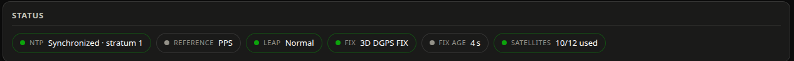

# Getting started
{: .no_toc }

<details open markdown="block">
  <summary>On this page</summary>
  {: .text-delta }
1. TOC
{:toc}
</details>

---

## Requirements

You need a working GPS-disciplined time stack already. StratumTap displays it; it does not
build it.

| Requirement | Notes |
|---|---|
| Debian 12 (bookworm) or Debian 13 (trixie), or similar | systemd is required. Raspberry Pi OS bookworm and trixie both work. |
| Python 3.11 or newer | Debian 12 ships 3.11, Debian 13 ships 3.13; both are tested. Nothing newer is needed. |
| `chrony` running | `chronyc tracking` must work **for an unprivileged user**. Debian's stock `chrony.conf` already allows this. |
| `gpsd` running with a device | Ideally with PPS. Verify with `gpspipe -w -n 5`. |
| Outbound HTTPS (optional) | Only for OpenStreetMap map tiles. Everything else works offline. |

Check the two prerequisites before you start:

```sh
chronyc tracking          # should print "Reference ID", "Stratum", ...
gpspipe -w -n 5           # should print JSON: VERSION, DEVICES, TPV, SKY, ...
```

{: .note }
> The installer never installs or reconfigures chrony or gpsd. It warns if `chronyc` is
> missing or `gpsd.service` is not active and then carries on — the time stack on an NTP
> server is not something a web UI's installer should touch.

---

## 1. Try it in demo mode

Demo mode serves plausible synthetic data — a fix at the Royal Observatory in Greenwich, a
stratum-1 chrony reference, satellites that come and go, and even synthetic NMEA sentences on
the live stream. It needs no GPS receiver and no chrony, so you can run it on your laptop
first.

```sh
git clone https://github.com/eholzhueter/StratumTap.git
cd StratumTap
make demo            # creates ./.venv, installs, runs with synthetic data
```

Open <http://127.0.0.1:8080/>. Every screenshot in this documentation was taken this way.

To use a different port: `make demo PORT=9000`.

{: .note }
> `make demo` needs `python3-venv`. On Debian: `sudo apt install python3-venv`.

Prefer to do it by hand?

```sh
python3 -m venv .venv
.venv/bin/pip install -r requirements.txt
STRATUMTAP_DEMO=1 .venv/bin/python -m stratumtap
```

---

## 2. Install on the NTP server

The normal path is to run the deploy script **from your development machine**. It copies the
repository to the target over ssh and runs the installer there.

```sh
bash deploy/deploy.sh --dry-run --host stratum1.local --user pi   # change nothing, show what would happen
bash deploy/deploy.sh --host stratum1.local --user pi             # do it
```

You need ssh access to the target and sudo rights there. The script uses `ssh -t` because
sudo may prompt for your password.

| Option | Meaning |
|---|---|
| `--dry-run`, `-n` | rsync in itemize mode, then stop. Nothing on the target changes. |
| `--host HOST` | Target hostname (also `TARGET_HOST=` in the environment). |
| `--user USER` | ssh user on the target (also `TARGET_USER=`). |
| `--port PORT` | Only used for the "open this URL" line it prints at the end. |

{: .warning }
> `deploy/deploy.sh` has a hard-coded default host and user in the script. Always pass
> `--host` / `--user`, or set `TARGET_HOST` / `TARGET_USER`, so you know where it is going.

### What the installer does

`deploy/install.sh` runs on the target as root and is idempotent — run it again to upgrade.

1. Installs `python3`, `python3-venv`, `rsync` and `curl` if missing. Warns (does not fail) if
   `chronyc` is absent or `gpsd.service` is not active.
2. Creates the `stratumtap` system user (no home directory, no shell) and adds it to the
   `_chrony` group where that group exists.
3. Rsyncs the source into `/opt/stratumtap/app`, excluding `.git`, `node_modules`, `.venv`,
   `tests` and the various caches.
4. Creates `/opt/stratumtap/venv` and installs the exactly pinned `requirements.txt`.
5. Copies the example environment file to `/etc/default/stratumtap` **only if it does not
   already exist**, so your configuration survives upgrades.
6. Installs and enables the hardened systemd unit, restarts it, then polls
   `http://127.0.0.1:<port>/api/v1/health` for up to 10 seconds and prints the result and the
   URL. On failure it dumps `journalctl -u stratumtap -n 50` for you.

There are no interactive prompts other than sudo asking for your password.

### Where things land

| Path | What it is |
|---|---|
| `/opt/stratumtap/app` | The application source, owned by root, read-only to the service |
| `/opt/stratumtap/venv` | The private virtualenv |
| `/etc/default/stratumtap` | Your configuration — created once, never overwritten |
| `/etc/systemd/system/stratumtap.service` | The systemd unit |
| — | No data directory: the service writes no files |

---

## 3. Manual install

If you would rather not use the deploy script, do the same thing by hand on the target:

```sh
# get the source onto the machine, then:
sudo bash /path/to/StratumTap/deploy/install.sh /path/to/StratumTap
```

Or fully by hand, without the installer:

```sh
sudo useradd --system --no-create-home --shell /usr/sbin/nologin stratumtap
sudo usermod -aG _chrony stratumtap                      # only if the group exists
sudo mkdir -p /opt/stratumtap
sudo rsync -a --exclude .git --exclude tests ./ /opt/stratumtap/app/
sudo python3 -m venv /opt/stratumtap/venv
sudo /opt/stratumtap/venv/bin/pip install -r /opt/stratumtap/app/requirements.txt
sudo install -m 0644 /opt/stratumtap/app/deploy/stratumtap.env.example /etc/default/stratumtap
sudo install -m 0644 /opt/stratumtap/app/deploy/stratumtap.service \
     /etc/systemd/system/stratumtap.service
sudo systemctl daemon-reload
sudo systemctl enable --now stratumtap
```

{: .note }
> If your system has no `_chrony` group, delete the `SupplementaryGroups=_chrony` line from
> the unit — systemd refuses to start a unit that references a group which does not exist.
> `chronyc` then reaches `chronyd` over UDP 323 on loopback, which Debian's default
> `chrony.conf` allows for any local user.

Check it came up:

```sh
systemctl status stratumtap
curl -s http://127.0.0.1:8080/api/v1/health | python3 -m json.tool
```

---

## 4. Open the UI

Browse to `http://<your-server>:8080/` — for example `http://stratum1.local:8080/`.

The first thing to look at is the status band at the top of the dashboard:



All green means chrony is synchronized and the receiver has a 3D fix. If something is red or
missing, see [Troubleshooting](troubleshooting.md).

Then set the two things most people want to change straight away, from the header:

- the **refresh interval** (default 2 s), and
- **Units** (metric, imperial or nautical).

Both are described in [Settings and header controls](user-guide/settings.md).

{: .note }
> There is no login. Anyone who can reach port 8080 sees your server's position. If the host
> runs a firewall, open the port deliberately and only to networks you trust:
> `sudo ufw allow from 192.0.2.0/24 to any port 8080 proto tcp`.

---

## 5. Updating

Deploy again. The installer is idempotent, keeps `/etc/default/stratumtap`, reuses the
virtualenv and restarts the service:

```sh
bash deploy/deploy.sh --host stratum1.local --user pi
```

After changing configuration by hand:

```sh
sudo systemctl restart stratumtap
```

{: .note }
> If the page looks unchanged after an upgrade, it is your browser, not the server —
> see [Troubleshooting](troubleshooting.md#after-upgrading-the-page-looks-old).

---

## 6. Uninstalling

```sh
sudo bash /opt/stratumtap/app/deploy/uninstall.sh
```

That stops and disables the service, removes the systemd unit and deletes `/opt/stratumtap`.
It keeps `/etc/default/stratumtap` and the `stratumtap` system user so a reinstall picks your
configuration back up.

To remove those too:

```sh
sudo bash /opt/stratumtap/app/deploy/uninstall.sh --purge
```

Nothing in chrony or gpsd is touched by either form.

---

## Day-to-day commands

```sh
sudo systemctl status stratumtap        # is it running?
sudo journalctl -u stratumtap -f        # follow the log
sudo systemctl restart stratumtap       # after editing /etc/default/stratumtap
curl -s http://127.0.0.1:8080/api/v1/health | python3 -m json.tool
```

Next: the [user guide](user-guide/index.md) walks through both views card by card.

## Keeping the service running

The installer sets StratumTap up as a systemd service that starts at boot and restarts itself
after any failure. This is what makes that true, and how to check it.

| Setting (in `/etc/systemd/system/stratumtap.service`) | Effect |
|---|---|
| `WantedBy=multi-user.target` + `systemctl enable` | Started automatically at every boot. `systemctl is-enabled stratumtap` must print `enabled`. |
| `After=network-online.target chrony.service gpsd.service` | Starts after the network and the time stack, so the first poll already has data. It does **not** *require* them — if gpsd is stopped, StratumTap still runs and shows "unavailable". |
| `Restart=always` + `RestartSec=5` | Restarted 5 s after *any* exit — crash, OOM kill, stray `kill`, or a clean exit. The only way it stays down is `systemctl stop`. |
| `StartLimitIntervalSec=0` | systemd normally gives up after 5 failed starts in 10 s and marks the unit `failed`. This disables that limit so it keeps retrying indefinitely; a fix (for example re-running the installer) takes effect on the next retry without a manual `systemctl start`. |

Check it:

```sh
systemctl is-enabled stratumtap        # enabled
systemctl is-active stratumtap         # active
systemctl status stratumtap            # uptime, PID, last log lines
journalctl -u stratumtap -b            # everything since this boot
curl -s http://127.0.0.1:8080/api/v1/health
```

If you installed by hand rather than with `install.sh`, the two commands that matter are:

```sh
sudo systemctl daemon-reload
sudo systemctl enable --now stratumtap
```

{: .warning }
> `Restart=always` cannot fix an environment that is broken before the first line of Python
> runs — most commonly a virtual environment left behind by an OS upgrade. See
> [Not running after a reboot or OS upgrade](troubleshooting.md#not-running-after-a-reboot-or-os-upgrade).

A reboot test is worth doing once after installing: `sudo reboot`, wait a minute, and open the
page. If it is not there, `journalctl -u stratumtap -b` says why.
