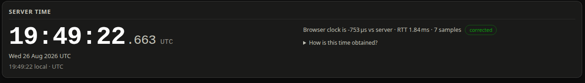
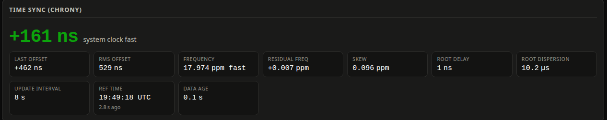
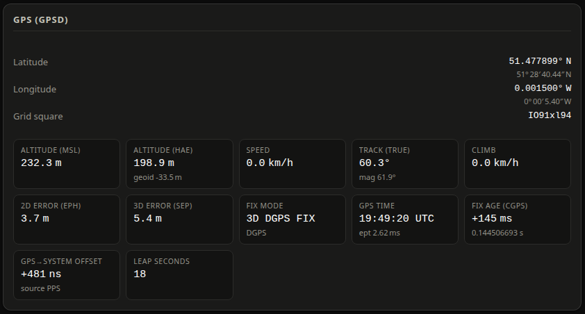
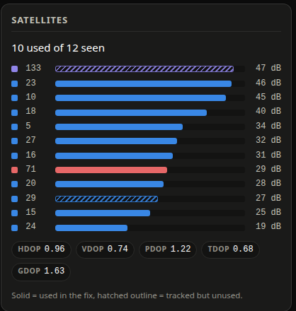
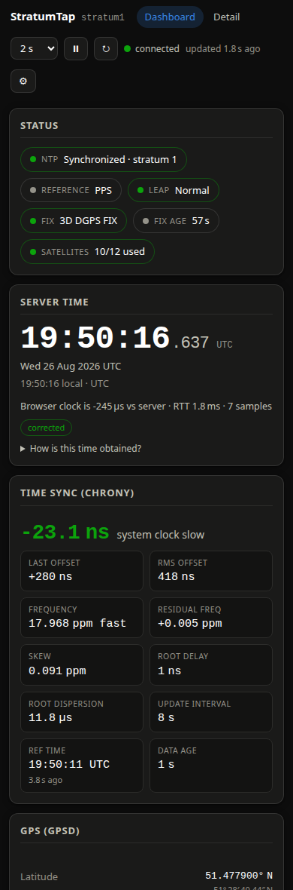

# Dashboard
{: .no_toc }

The front page at `/#/`. Read it top to bottom: is it working, what time is it, how good is
the discipline, where are we, and which satellites are we using.

  
On this page

  {: .text-delta }
1. TOC
{:toc}

---

## Status pills

The band answers "is it working?" before you read anything else. Green is good, amber is
worth a look, red needs attention.

| Pill | Meaning |
|---|---|
| **NTP** | *Synchronized · stratum N* when chrony has a usable reference (stratum below 16 and the leap status is not "Not synchronised"). Red *Not synchronized* otherwise, and red *unavailable* if `chronyc` could not be run at all. |
| **Reference** | The name chrony prints in parentheses on its "Reference ID" line — `PPS` for a PPS refclock, a hostname or IP for a network server. Hover it for the raw hexadecimal reference ID. |
| **Leap** | chrony's leap-second status: *Normal*, *Insert second*, *Delete second* or *Not synchronised*. Anything other than *Normal* is amber. |
| **Fix** | The cgps-style fix label: `NO FIX`, `2D FIX`, `3D FIX`, `3D DGPS FIX` and so on. Green from a 2D fix upward. |
| **Fix age** | How long the fix *mode* has been unchanged — the "(6 secs)" cgps shows next to the fix. This is **not** how stale the position is. |
| **Satellites** | Used of seen. Green from four used (the minimum for a 3D fix), amber below. |

If gpsd is unreachable you get a single red **GPS** pill saying *gpsd not connected* instead
of the fix pills.

---

## Server time

The big clock is the **server's** wall clock, in UTC, ticking about 20 times a second. The
line under it repeats the same instant in your browser's local time zone.

There are two ways to display it, and the badge on the right tells you which is in use.

**corrected** (the default)
: `Date.now() + offset` — your browser's clock plus the measured difference between your clock
  and the server's. This is a *live* clock: it keeps its accuracy between polls, and it is
  corrected for the network delay of getting the timestamp to you.

**as received**
: `t2 + (now − t3)` — the timestamp exactly as it arrived, ticking forward on your local
  clock. This is what a naive "the server said X" display shows, and it lags real server time
  by roughly half the round trip. Useful when you want to see the uncorrected value.

Toggle between them with **Correct for network delay** in the header.

### The readout line

> Browser clock is −753 µs vs server · RTT 1.84 ms · 7 samples

- **Browser clock is −753 µs vs server** — *your* clock, relative to the server's. Negative
  means your workstation is behind the server; positive means it is ahead. This is a genuinely
  useful measurement: it is a free check on the machine you are sitting at.
- **RTT 1.84 ms** — the round-trip delay of the best sample, with the server's own processing
  time already subtracted. The offset above can be wrong by at most about half of this if the
  network path is asymmetric.
- **7 samples** — how many exchanges are in the estimator's ring. It keeps the last eight and
  trusts the one with the lowest delay.

Expand **How is this time obtained?** for a one-paragraph summary, or read the full article:
[How the browser time correction works](../technical/time-correction.md).

---

## Time sync (chrony)

The big figure is chrony's **System time** — how far the server's system clock is ahead of or
behind true time right now.

{: .note }
> **Sign convention:** positive means the system clock is **fast** (ahead of true time);
> negative means **slow**. The word next to the number says which, so you never have to
> remember. This is the same sense `chronyc tracking` prints as "0.000000372 seconds fast".

The figure is colored by absolute size: green under 100 µs, amber under 10 ms, red above.

| Tile | One line |
|---|---|
| **Last offset** | The offset measured at the most recent clock update. Same sign sense as the big number. |
| **RMS offset** | Long-term root-mean-square average of the offsets — a stability figure. Always positive. |
| **Frequency** | How fast or slow the system clock would run without correction, in parts per million. The word *fast* or *slow* follows the number. |
| **Residual freq** | The frequency error still visible in the current reference's measurements. Near zero when chrony has settled. |
| **Skew** | chrony's own estimated error bound on the frequency, in ppm. Smaller is more confident. |
| **Root delay** | Total round-trip network delay to the stratum-0 source. Essentially zero for a local PPS refclock. |
| **Root dispersion** | Accumulated error bound inherited from the whole chain of servers up to stratum 0. |
| **Update interval** | Seconds between chrony's last two clock updates. |
| **Ref time** | UTC time of the last measurement from the reference, with "N ago" underneath. |
| **Data age** | How long ago StratumTap last ran `chronyc` successfully. Normally well under a second. |

If `chronyc` fails, the card shows a red banner with chrony's own message (for example
`506 Cannot talk to daemon`) and the tiles go blank. See
[Troubleshooting](../troubleshooting.md#ntp-unavailable).

Every one of these numbers is unpacked in [What every number means](../technical/measurements.md).

---

## GPS (gpsd)

Position first, in decimal degrees with degrees/minutes/seconds underneath, plus the
8-character Maidenhead grid square (handy for radio work).

| Tile | One line |
|---|---|
| **Altitude (MSL)** | Height above mean sea level — the number a map would give you. |
| **Altitude (HAE)** | Height above the WGS-84 ellipsoid, which is what GNSS actually measures. The sub-line shows the geoid separation between the two. |
| **Speed** / **Track (true)** / **Climb** | Motion. On a fixed timing installation these hover around zero and are mostly a noise indicator. Track has the magnetic bearing underneath when the receiver reports it. |
| **2D error (EPH)** | Horizontal 1σ error estimate — the radius of the accuracy circle on the map. |
| **3D error (SEP)** | Spherical (3D) 1σ error estimate. |
| **Fix mode** | `3D DGPS FIX` and friends, with the status word (`DGPS`, `RTK fixed`, …) underneath. |
| **GPS time** | The timestamp inside the last position report, with the receiver's own time error estimate (`ept`) underneath. |
| **Fix age (cgps)** | Server send time minus the fix timestamp — exactly the line `cgps -s` labels "Time offset". Typically hundreds of milliseconds, because the receiver stamps a fix and then takes a moment to send it over the serial line. |
| **GPS→system offset** | System clock minus GPS time, from gpsd's `PPS` or `TOFF` messages. With PPS this is microseconds or better; with `TOFF` on a plain NMEA receiver it is typically 0.1–1 s of serial latency. The sub-line names the source. |
| **Leap seconds** | The current GPS-to-UTC leap-second count, when the receiver reports it. |

{: .note }
> **"Fix age" and "GPS→system offset" are different numbers and both are correct.**
> The first is how stale the last fix report is; the second is how far the system clock is
> from GPS time. They can differ by six orders of magnitude on a PPS-disciplined server.
> [The three time offsets, explained](../technical/measurements.md#the-three-time-offsets).

---

## Satellites

Up to sixteen satellites, strongest signal first, so the list reads top-down as a
signal-quality ranking.

- The number on the left is the satellite's **svid** — the conventional number you would quote
  (GPS 23, SBAS 133, GLONASS 71). The little square is colored by constellation, matching the
  [sky plot](detail-view.md#sky-plot).
- The bar length is SNR in dB-Hz, scaled so 50 dB fills the bar. The value is printed on the
  right.
- **Solid fill = used in the fix. Hatched outline = tracked but not used.** A satellite can be
  tracked and excluded for many reasons — too low, unhealthy, an SBAS satellite the receiver
  uses for corrections rather than ranging, or simply more satellites than the solution needs.

Underneath, the dilution-of-precision chips: **HDOP** (horizontal), **VDOP** (vertical),
**PDOP** (position, 3D), **TDOP** (time) and **GDOP** (everything including time). Lower is
better; under 2 is good geometry.

{: .note }
> DOP describes *satellite geometry only* — how well spread out the satellites are in the sky.
> It says nothing about signal quality. Multiply DOP by the receiver's ranging error to get an
> error estimate; that is roughly what the EPH/SEP numbers already are.

---

## On a phone

Cards stack into one column and the second header row collapses into a **&#9881;** popover.
The full-height captures are here if you want them:
[dashboard](../assets/screenshots/mobile-dashboard.png) and
[detail](../assets/screenshots/mobile-detail.png).

---

## Where to go next

The link at the bottom right — *Detail view: map, sky plot, gauge, history →* — takes you to
[the detail view](detail-view.md), which has all of the above plus the map, the accuracy
gauge, history charts and the raw output.
