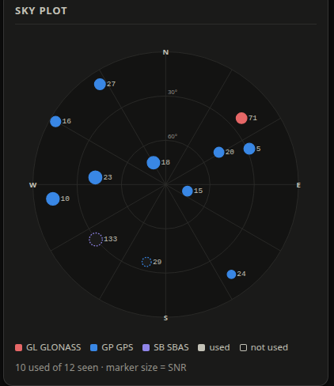
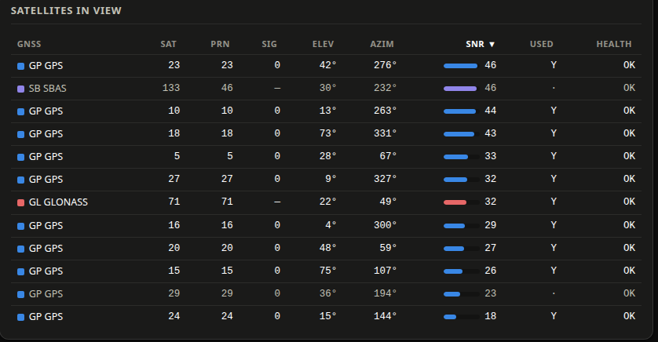
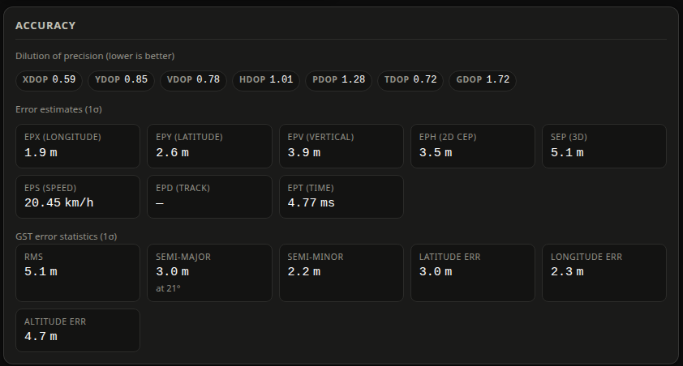
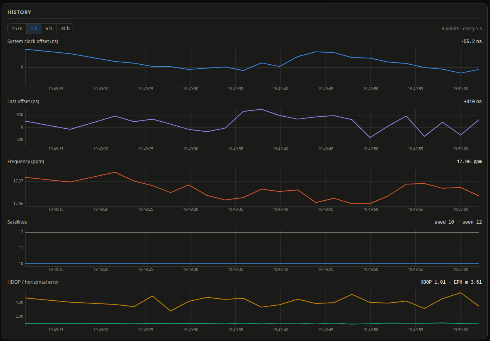
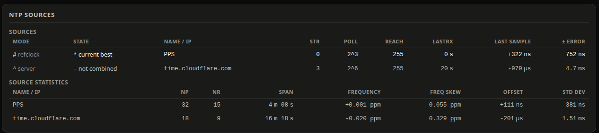
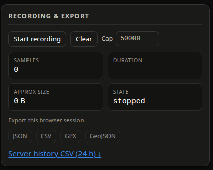
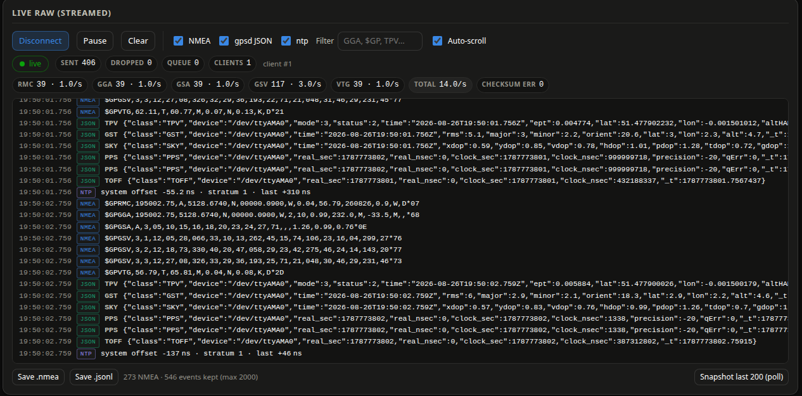
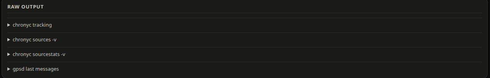
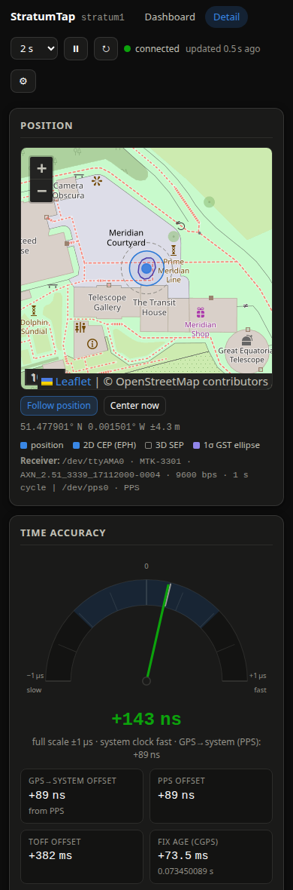

# Detail view
{: .no_toc }

Everything the dashboard leaves out, at `/#/detail`. Cards are laid out in a responsive grid,
so on a phone they stack in the order below.

  
On this page

  {: .text-delta }
1. TOC
{:toc}

---

## Position (the map)

A Leaflet map centered on the current fix.

| Layer | What it is |
|---|---|
| **Marker** | The reported position. |
| **2D CEP circle** (solid blue) | Radius = `EPH`, the horizontal 1σ error estimate. |
| **3D SEP circle** (dashed gray) | Radius = `SEP`, the spherical 1σ error estimate. Always the larger of the two. |
| **1σ GST ellipse** (violet) | The receiver's own error ellipse from NMEA `GST` — semi-major, semi-minor and orientation. Only drawn when the receiver actually sends `GST`. |

The legend under the map lists whichever of these are present with their current values, and
the line below it names the receiver gpsd is using: device path, driver, firmware subtype,
baud rate, cycle time, and any other devices gpsd knows about (a `/dev/pps0` PPS device
usually shows up here too).

### Follow and center

- **Follow position** is a toggle. While it is on, the map recenters as the position updates.
  Dragging the map turns it off — the map should never fight you.
- **Center now** recenters once without changing the toggle.

On the first fix the map frames the accuracy circle rather than jumping to a fixed zoom, so a
4 m CEP is actually visible instead of one pixel wide.

### Offline and blocked tiles

Leaflet itself is vendored into the application, so the map code always loads. Only the
*tiles* come from the internet. If a tile fetch fails the map says so once and keeps working:
the marker, the circles and the recorded track still draw on a blank background, and the
position readout below is unaffected.

For a fully offline install, point `STRATUMTAP_TILE_URL` at a local tile server — see
[Configuration](../configuration.md#map-tiles).

---

## Time accuracy (the gauge)

The needle shows chrony's system-clock offset. Zero is straight up; **negative (slow) sweeps
left, positive (fast) sweeps right**, and the words *slow* and *fast* are printed at the ends
so you never have to remember.

### Auto-scaling

The dial picks its full scale from a fixed decade ladder — 1 µs, 10 µs, 100 µs, 1 ms, 10 ms,
100 ms, 1 s, 10 s — so two glances at different times are comparable. The line under the
reading always states the current full scale, for example *full scale ±1 µs*.

- It tracks the peak of the last 60 readings and picks the smallest rung that is at least
  1.25 × that peak, leaving the needle a little headroom.
- **Growing is immediate.** A spike has to be visible at once.
- **Shrinking is sticky.** It only steps down after the value has stayed under 20 % of the
  current full scale for 30 consecutive readings. A rung that is too big is merely
  unflattering; a rung that keeps flapping is unreadable.

### Colors

The needle and the reading are colored by the **absolute** offset, never by where the needle
sits on the arc — otherwise a tiny offset on a tiny scale would look alarming.

| Color | Absolute offset |
|---|---|
| Green | under 100 µs |
| Amber | 100 µs to 10 ms |
| Red | over 10 ms |

A faint tick mark on the arc shows the last offset and the RMS band, for context.

### The tiles under the gauge

| Tile | Meaning |
|---|---|
| **GPS→system offset** | The offset currently in use, from `PPS` if recent, otherwise `TOFF`. The sub-line names the source. |
| **PPS offset** | The last value from a gpsd `PPS` message. Microseconds or better on a wired PPS. |
| **TOFF offset** | The last value from a gpsd `TOFF` message — the serial-line timing, typically hundreds of milliseconds. |
| **Fix age (cgps)** | Server send time minus the fix timestamp, with the nine-decimal string cgps would print underneath. |
| **Last offset** / **RMS offset** | The same chrony values as on the dashboard, repeated here so the gauge card stands alone. |

{: .note }
> Seeing three different "offsets" that disagree by a factor of a million is normal and
> correct. [Here is why](../technical/measurements.md#the-three-time-offsets).

---

## Sky plot

A polar view of the sky above the antenna.

- **North is up**, east to the right — compass bearings, drawn the way you would hold a map.
- **The rings are elevation.** The outer ring is the horizon (0°), the center is straight
  overhead (90°), and labelled rings mark 30° and 60°. Radius is proportional to zenith
  angle: `r = R × (90 − elevation) / 90`, the same projection cgps uses.
- **Color is constellation** — GPS blue, GLONASS red, Galileo green, BeiDou amber, SBAS
  violet, QZSS aqua, NavIC magenta, unknown gray. The legend lists only the constellations
  actually in view.
- **Filled = used in the fix. Hollow with a dashed outline = tracked but not used.**
- **Marker size is SNR.** Bigger dot, stronger signal. The caption repeats *marker size = SNR*.
- Every marker carries its satellite number as a label, so identity never depends on color
  alone.

Satellites bunched on one side, or all at low elevation, is what bad geometry looks like —
and it is what a high HDOP in the [Accuracy](#accuracy) card is telling you numerically.

---

## Satellites in view

The same satellites as a sortable table. Click any column header to sort by it; click again to
reverse. It opens sorted by SNR, strongest first.

| Column | Meaning |
|---|---|
| **GNSS** | Two-letter constellation code and name: `GP` GPS, `GL` GLONASS, `GA` Galileo, `BD` BeiDou, `SB` SBAS, `QZ` QZSS, `IR` NavIC, `IM` IMES, `??` unknown. |
| **Sat** | The satellite's **svid** — the conventional number, the one cgps prints first and the one you would quote. SBAS 133, for example. |
| **PRN** | gpsd's internal PRN for the same satellite. For that SBAS satellite it is 46. |
| **Sig** | Signal ID, for receivers that report more than one band per satellite. |
| **Elev** / **Azim** | Elevation above the horizon and compass bearing, in degrees. |
| **SNR** | Carrier-to-noise density in dB-Hz, with a small bar. Above ~35 is strong, below ~20 is marginal. |
| **Used** | `Y` if this satellite contributed to the fix, `·` if not. |
| **Health** | The receiver's health flag, when it reports one. |

{: .note }
> **Why two satellite numbers?** gpsd reports both `svid` (the conventional per-constellation
> number) and its own internal `PRN` (a single flat numbering across all constellations).
> They match for GPS satellites and diverge for SBAS, GLONASS and the rest. StratumTap shows
> `svid` as the primary number and `PRN` alongside, exactly as `cgps` does.

A receiver tracking two frequency bands may list the same satellite twice with different
`Sig` values. That is not a bug — see [Receivers](../technical/receivers.md).

---

## Accuracy

Three groups, all reported by the receiver rather than computed by StratumTap.

**Dilution of precision (lower is better).** Pure geometry — how well spread the satellites
are. `XDOP`/`YDOP` are the east and north components, `VDOP` vertical, `HDOP` horizontal,
`PDOP` 3D position, `TDOP` time and `GDOP` everything together. Under 2 is good.

**Error estimates (1σ).** The receiver's own guess at its error, one standard deviation.

| | |
|---|---|
| **EPX** / **EPY** / **EPV** | Longitude, latitude and vertical error, per axis. |
| **EPH (2D CEP)** | Horizontal error — the map's solid accuracy circle. |
| **SEP (3D)** | Spherical error, always larger than EPH. The map's dashed circle. |
| **EPS (speed)** / **EPD (track)** | Speed and course error estimates. |
| **EPT (time)** | The receiver's error estimate on its own time stamp. |

**GST error statistics (1σ).** Only present when the receiver emits the NMEA `GST` sentence.
This is a proper error *ellipse* rather than a circle: `RMS` of the pseudorange residuals,
the semi-major and semi-minor axes with the major axis's bearing from true north, and
per-axis latitude, longitude and altitude errors. The semi-major axis and orientation are what
the violet ellipse on the map draws.

An em dash means the receiver does not report that field. Plenty of perfectly good receivers
report only some of these.

---

## History

Five stacked time-series charts, drawn on a canvas with no chart library.

| Chart | Series |
|---|---|
| **System clock offset** | chrony's system offset, with a zero line. |
| **Last offset** | The per-update offset, with a zero line. |
| **Frequency** | The clock frequency correction in ppm. |
| **Satellites** | Used and seen, as two lines. |
| **HDOP / horizontal error** | HDOP and EPH together. |

**Ranges:** 15 m, 1 h, 6 h, 24 h. Your choice is remembered.

The data comes from the server's own ring buffer (`/api/v1/history`), which samples every 5 s
and holds 24 hours by default — **so the charts are populated even if no browser was open**.
Live poll results are appended to the right edge as they arrive, stamped with the *server's*
clock so the live points and the history rows sit on the same timeline. The header on the
right says how many points are plotted and at what interval; long ranges are downsampled to
keep the chart readable.

Hover (or touch) a chart for a readout of the values at that instant. Gaps in a line are real:
a null value draws a break, never a zero.

{: .note }
> The buffer lives in memory. Restarting the service clears the history. Change the depth with
> `STRATUMTAP_HISTORY_INTERVAL_S` and `STRATUMTAP_HISTORY_SIZE` — see
> [Configuration](../configuration.md).

---

## NTP sources

The parsed output of `chronyc sources` and `chronyc sourcestats`, refreshed at most every
10 seconds.

### Sources

| Column | Meaning |
|---|---|
| **Mode** | `^` server, `=` peer, `#` refclock — with the word spelled out. |
| **State** | `*` current best, `+` combined, `-` not combined, `x` falseticker, `~` too variable, `?` unusable. |
| **Name / IP** | The source, as chrony prints it in CSV mode (no reverse DNS). The verbatim `chronyc sources -v` output in [Raw output](#raw-output) has resolved hostnames. |
| **Str** | The source's stratum. A PPS refclock is stratum 0. |
| **Poll** | Polling interval as a power of two. `2^3` is 8 seconds; hover for the value in seconds. |
| **Reach** | The eight-bit reachability register. `255` (octal 377) means the last eight polls all arrived. |
| **LastRx** | Seconds since the last sample from this source. An em dash means it has never been received. |
| **Last sample** | The offset of the most recent sample, signed. |
| **± Error** | The margin of error on that sample. |

On a GPS-disciplined server you normally see one `#` refclock marked `*` current best, plus
whatever internet servers you keep as a sanity check, marked `-` not combined.

### Source statistics

| Column | Meaning |
|---|---|
| **NP** | Sample points retained for this source. |
| **NR** | Runs of residuals of the same sign — a regression-fit quality indicator. |
| **Span** | Time span covered by those samples. |
| **Frequency** | The source's estimated frequency residual, in ppm. |
| **Freq skew** | The error bound on that frequency. |
| **Offset** | The offset at the last sample, from the regression. |
| **Std dev** | Standard deviation of the samples. |

---

## Recording & export

Arm the recorder and every poll is kept in memory for export. Covered on its own page:
[Recording and export](recording-export.md).

---

## Live raw (streamed)

An on-demand Server-Sent Events console showing raw NMEA, gpsd JSON and chrony updates as
they happen. Covered on its own page: [Live raw stream](live-raw.md).

---

## Raw output

Four collapsible panels holding exactly what the underlying tools produced, for when you want
to see it verbatim or paste it into a mailing-list post.

| Panel | Content |
|---|---|
| **chronyc tracking** | The human-readable tracking report, unmodified. |
| **chronyc sources -v** | Including chrony's own legend, and with hostnames resolved. |
| **chronyc sourcestats -v** | Likewise. |
| **gpsd last messages** | The last raw JSON object gpsd sent for each class — `TPV`, `SKY`, `GST`, `PPS`, `TOFF`, `DEVICES`, `VERSION` and any other class it emits. |

Nothing is fetched until you open a panel. Once open, a panel refreshes with each poll.

If a collector is failing, the panel shows a one-line explanation instead of tool output — for
example `chronyc tracking unavailable: 506 Cannot talk to daemon`.

---

## On a phone

Everything stacks into one column. The satellite table and the history charts scroll
horizontally inside their own cards rather than making the page scroll sideways, and the
header controls collapse into the ⚙ popover.
