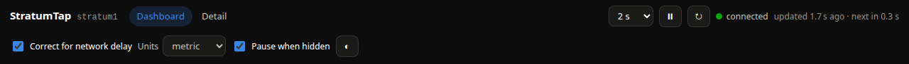
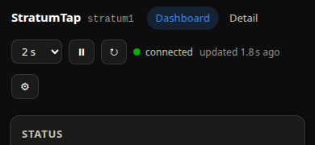

# Settings and header controls
{: .no_toc }

Everything you can change from the browser lives in the header, and every choice is per
browser — not per server.

<details open markdown="block">
  <summary>On this page</summary>
  {: .text-delta }
1. TOC
{:toc}
</details>



---

## Refresh interval

The select on the right sets how often the browser calls `/api/v1/status`. The choices come
from the server (`1, 2, 5, 10, 30, 60 s` by default, configurable with
`STRATUMTAP_REFRESH_CHOICES_S`) plus **Off**.

The first time you open StratumTap it adopts the server's default (`STRATUMTAP_DEFAULT_REFRESH_S`,
2 s). Once *you* pick a rate, that choice wins and the server default no longer overrides it.

Next to it, the meta line reads `updated N s ago · next in N s`, so you always know how fresh
what you are looking at is.

{: .note }
> Polling faster than 1 s buys you nothing: the server itself only polls `chronyc` once a
> second and gpsd delivers a position once per receiver cycle. Requests are cheap — handlers
> only read memory, they never run a subprocess — but the data underneath does not change any
> faster.

### Pause

The **⏸** button stops polling entirely. The server clock keeps ticking (it is computed from
your own clock plus the measured offset), but every data value freezes at its last reading and
the meta line stops counting down. **▶** resumes.

The **↻** button forces one refresh immediately and clears any error backoff, so you do not
have to wait out a retry timer after the server has come back.

### Pause when hidden

On by default. While the tab is in the background, polling stops; it resumes the moment you
come back. This is what stops a forgotten tab from polling your Pi all week.

It also closes the [live raw stream](live-raw.md) when the tab goes to the background.

Turn it off if you keep StratumTap on a second monitor behind another window and want the
history charts to keep filling.

---

## Correct for network delay

The single most interesting toggle. It chooses how the big server clock on the dashboard is
computed.

| Setting | Display | Badge |
|---|---|---|
| **On** (default) | `Date.now() + offset` — your clock plus the measured server-minus-browser offset. Corrected for the network delay of delivering the timestamp. | `corrected` |
| **Off** | `t2 + (now − t3)` — the server's timestamp exactly as it arrived, ticking forward on your local clock. Lags real server time by roughly half the round trip. | `as received` |

Either way the readout line next to the clock shows the measured offset, the round-trip time
and the sample count, so you can judge how much the correction is worth.

Turning it off is a good way to *see* what the correction is doing: on a LAN the two displays
differ by a fraction of a millisecond; over a VPN or a slow link the difference is obvious.

Full explanation: [How the browser time correction works](../technical/time-correction.md).

---

## Units

Applies to distances, altitudes and speeds throughout both views.

| Setting | Distances | Speeds |
|---|---|---|
| **metric** | meters | km/h |
| **imperial** | feet | mph |
| **nautical** | meters for small values, nautical miles for large | knots |

Latitude and longitude are always shown in decimal degrees with degrees/minutes/seconds
underneath, and time values are always SI (ns, µs, ms, s) regardless of this setting — a
nanosecond is a nanosecond in every unit system.

---

## Theme

The **☀ / ☾ / ◐** button cycles light, dark and auto.

**Auto** follows your operating system's light/dark preference and switches with it, which is
what you want for a screen that is on all day.

---

## Other remembered choices

These have no header control; they are remembered wherever you set them.

| Setting | Where | Default |
|---|---|---|
| History chart range | The 15 m / 1 h / 6 h / 24 h buttons on the detail view | 1 h |
| Map follow | The **Follow position** toggle on the map | on |
| Recorder cap | The **Cap** field on the Recording card | 50 000 |
| Live raw: connected, which sources, filter text, auto-scroll | The Live raw panel | disconnected, all sources on, no filter, auto-scroll on |

---

## Where settings are stored

In your browser's `localStorage`, under the key `stratumtap.settings.v1`, as a single JSON
object.

That means:

- Settings are **per browser and per origin**. Your laptop and your phone keep separate
  choices, and so do two different browsers on the same machine.
- They survive reloads and restarts, and they are never sent to the server.
- Clearing site data, or using a private window, resets everything to the defaults.
- If `localStorage` is unavailable — private mode, blocked cookies, some kiosk setups —
  StratumTap runs on the defaults and simply does not persist anything. Nothing breaks.

To reset everything, clear site data for the StratumTap origin in your browser's settings, or
run this in the developer console:

```js
localStorage.removeItem('stratumtap.settings.v1'); location.reload();
```

A setting stored by an older version that no longer exists is ignored, and a setting added by
a newer version appears at its default — upgrading never leaves you with a half-configured
page.

---

## Keyboard and mobile

There are **no custom keyboard shortcuts**. Everything is a real button, link, checkbox or
select, so Tab moves between controls, Space and Enter activate them, and screen readers get
proper labels. The satellite table's column headers are buttons: Tab to one and press Enter to
sort by it.

On a narrow screen:



- The second header row collapses into a **⚙** popover holding *Correct for network delay*,
  *Units*, *Pause when hidden* and the theme button.
- Cards stack into a single column.
- Wide content — the satellite table, the history charts, the raw output — scrolls inside its
  own card rather than making the whole page scroll sideways.
- The map, sky plot and gauge are all touch-friendly; pinch-zoom works on the map.

{: .note }
> On a phone, consider setting the refresh interval to 5 s or 10 s and leaving **Pause when
> hidden** on. Mobile browsers throttle background tabs anyway, and it saves battery.
